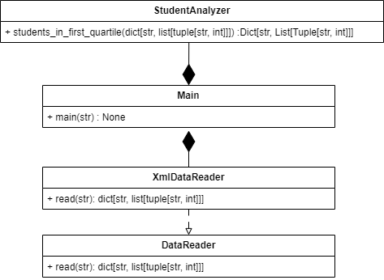

# Лабораторная 1 по дисциплине "Технологии программирования"

## Вариант 5

**Формат входного файла**: XML

**Расчетная процедура**: Определить и вывести на экран всех студентов, чей рейтинг попадает в первую квартиль распределения по рейтингам

## Используемые технологии:
**Язык программирования:** Python

**Тесты:** Pytest

**Линтер:** Pycodestyle

## Диаграмма классов:
